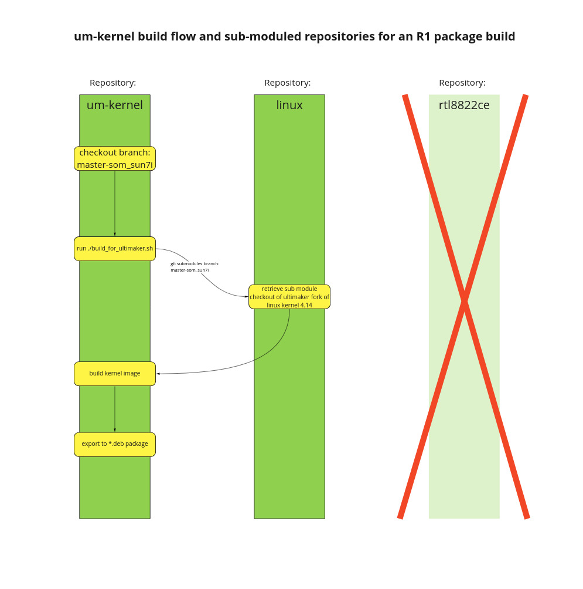

Copyright © Ultimaker 2015-2022

# Introduction
This repository contains the Ultimaker package build script for the kernel. Currently, our kernel image is a fork of the linux mainline kernel 4.14.

## Table of Contents

* **[Environment](#environment)**
    * **[Intended Architecture](#intended-architecture)** 
    * **[Common directory variables](#common-directory-variables)** 
    * **[Build configuration](#build-configuration)**
    * **[Debian package information](#debian-package-information)**
    * **[Which kernel to build](#which-kernel-to-build)**
    * **[Internal variables](#internal-variables)**
    * **[Busy box version](#busy-box-version)**
    * **[Artifact names](#artifact-names)**
* **[Repository Structure](#repository-structure)**
    * **[Config directory](#repo-root-directory)**
    * **[dts](#dts)**
    * **[scripts](#scripts)**
    * **[linux](#linux)**
    * **[Older branches](#older-branches)**
* **[How to build locally](#how-to-build-locally)**
* **[Using GitLab CI to build the packages](#using-gitlab-ci-to-build-the-packages)**
* **[Important to note](#important-to-note)**
* **[Installing a package on a printer](#installing-a-package-on-a-printer)**
    * **[Installing on an R1 printer](#installing-on-an-r1-printer)**
    * **[Installing on an R2 or Sonic printer](#installing-on-an-r2-or-sonic-printer)**
---
## Environment

The following environment is used consistently throughout all the scripts in this repository.
* To verify that the local environment is compliant and able to build the package a script called ```buildenv_check.sh``` exists in the root directory of this
repository. When building under docker, this script is automatically run.

#### Intended Architecture
```
ARCH="${ARCH:-armhf}"
UM_ARCH="${UM_ARCH:-}" Can be sun7i or imx6dl
```
- ```sun7i``` is for the **R1** machines
- ```imx6dl``` is for the **R2 & Sonic** machines

#### Common directory variables
```
SYSCONFDIR="${SYSCONFDIR:-/etc}"
LOCAL_REGISTRY_IMAGE="um_kernel"
ARCH="${ARCH:-armhf}"
SRC_DIR="$(pwd)"
PREFIX="/usr"
RELEASE_VERSION="${RELEASE_VERSION:-9999.99.99}"
DOCKER_WORK_DIR="/build"
INITRAMFS_SOURCE="${INITRAMFS_SOURCE:-initramfs/initramfs.lst}"
DEPMOD="${DEPMOD:-/sbin/depmod}"
```
#### Build configuration
```
SRC_DIR="$(pwd)"
BUILD_DIR_TEMPLATE="_build_${ARCH}"
BUILD_DIR="${BUILD_DIR:-${SRC_DIR}/${BUILD_DIR_TEMPLATE}}"
```
#### Debian package information
```
PACKAGE_NAME="${PACKAGE_NAME:-um-kernel}"
RELEASE_VERSION="${RELEASE_VERSION:-999.999.999}"
```

#### Which kernel to build
```
# Which kernel to build
LINUX_SRC_DIR=${SRC_DIR}/linux
# Which kernel config to build.
BUILDCONFIG="msc-sm2-imx6dl-ultimain4.2"
```

#### Internal variables
```
KCONFIG="${SRC_DIR}/configs/${BUILDCONFIG}_config"
KERNEL_BUILD_DIR="${BUILD_DIR}/${BUILDCONFIG}-linux"
KERNEL_IMAGE="uImage-${BUILDCONFIG}"
DEBIAN_DIR="${BUILD_DIR}/debian"
BOOT_FILE_OUTPUT_DIR="${DEBIAN_DIR}/boot"

INITRAMFS_MODULES_REQUIRED="ci_hdrc_imx.ko ci_hdrc.ko usbmisc_imx.ko usb-otg-fsm.ko phy-mxs-usb.ko \
    dw_hdmi-imx.ko dw-hdmi.ko etnaviv.ko imxdrm.ko imx-ipu-v3.ko loop.ko imx2_wdt.ko"
INITRAMFS_SOURCE="${INITRAMFS_SOURCE:-initramfs/initramfs.lst}"
```

#### Busy Box version
```
BB_VERSION="1.31.0"
BB_URL="https://busybox.net/downloads/busybox-${BB_VERSION}.tar.bz2"
BB_BIN="busybox"
BB_PKG="busybox-${BB_VERSION}.tar.bz2"
BB_DIR="busybox-${BB_VERSION}"
```
#### Artifact names
```
DEB_PACKAGE="${PACKAGE_NAME}_${RELEASE_VERSION}-${UM_ARCH}_${ARCH}.deb"
```


## Repository Structure
#### Configs directory:
The configs directory contains our kernel configuration. We currently have config files for the R1 and R2 builds.
```
R1 config file = opinicus_config
R2 config file = msc-sm2-imx6dl-ultimain4.2_config
```

#### dts
The dts directory contains our device tree's. While in the future this may be
dropped and replaced with overlays for the lime2, for now we have a full
device tree file for our Ultimaker 3 platform. There are 2 variants however,
one for eMMC based storage, and one for NAND based storage. The NAND based dts
file is a symlink for now, until all our dependencies for this package
disappear.

#### scripts
The scripts directory contains some tools and scripts for our build process.
Currently it houses the boot splash generator, which is a small utility that
generates the i2c commands to create a splashscreen on the Ultimaker 3
display.

#### linux
This is the linux kernel source tree. Ideally, this contains no changes to the
upstream kernel. Currently we have a small amount of patches ontop of the
stable linux kernel. The repository currently has a few branches.
The branch for R1 builds is *master-som_sun7i*. The branch for R2 and Sonic builds is *master-som_imx6*.

#### Older branches
(not needed for builds but kept as documentation)
* archive/opinicus_v4.2.0-rc7_v2	Our old kernel tree with modifications
* opinicus_v4.2.0-rc7			The unmodified kernel from above

* opinicus-4.9.13_0			Our current kernel based on 4.9.13 tag
* opinicus-4.10.1_0			An experimental future kernel

## How to build locally
* This repository is setup to use an existing *Docker* image from this repositories Docker registry.
* The image contains all the tools to be able to build the software.
    * When Docker is not installed the build script will try to build on the host machine and is likely to fail because the required tools are not installed. 
* When it is necessary to run the build without Docker, execute the ```buildenv_check.sh``` script and see if the environment is missing requirements.
* **By default**, the build script runs an environment check, then builds the kernel image. The first can be disabled.

Run the help of the ```build_for_ultimaker.sh``` script for usage information:
```
> ./build_for_ultimaker.sh -h
    Usage: ./build_for_ultimaker.sh [OPTIONS]
        -c   Clean the workspace
        -C   Skip run of build environment checks
        -h   Print usage
```
* To build locally, run:
```
RELEASE_VERSION=maj.min.patch ./build_for_ultimaker.sh
```
#### Local build flow


## Using GitLab CI to build the packages
Using GitLab Ci to build the **R1** and **R2** um-kernel packages will allow us to track builds of this package:

```
Checkout prime-jedi master branch to a local dir
git clone git@github.com:Ultimaker/prime-jedi.git

cd to your um-kernel directory and check out the appropriate branch,
for R1 machines checkout master-som_sun7i
for R2 & Sonic machines checkout master-som_imx6

Then run the command from within your um-kernel root dir:
./path/to/prime-jedi/release.sh maj.min.patch
```
This will create a tag which will be pushed to um-kernel and gitlab CI will create the package with the specified version number for that branch.
The package will be versioned and labelled correctly by cloudsmith and be placed in the correct package repository.

## Important to note
There is a difference in the types of architectures used for the **R1** and the **R2 & Sonic** machines:
* ```sun7i``` is for the R1 machines
    * This package will need to be built from **master-som_sun7i**
* ```imx6dl``` is for the R2 & Sonic machines
    * This package will need to be built from the **master-som_imx6** branch

## Installing a package on a printer
### Installing on an R1 printer
scp/copy the built R1 package (um-kernel-<version>-sun7i.deb) to your printer and execute the commands below in order.
```
mount /dev/mmcblk1p1 /boot
dpkg -i um-kernel-<version>-sun7i.deb
sync
reboot
```

### Installing on an R2  or Sonic printer
scp/copy the built R2 package (um-kernel-<version>-imx6.deb) to your printer and execute the commands below in order.
```
mount /dev/mmcblk2p1 /boot
dpkg -i um-kernel-<version>-imx6dl.deb
sync
reboot
```